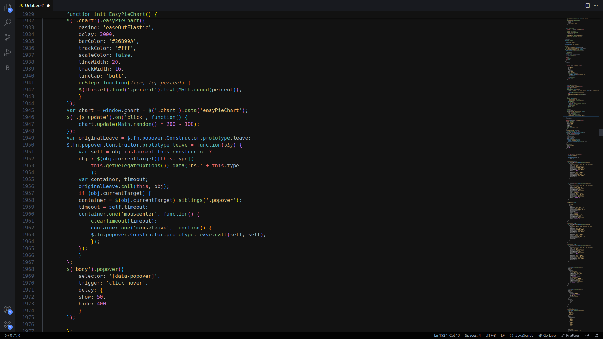
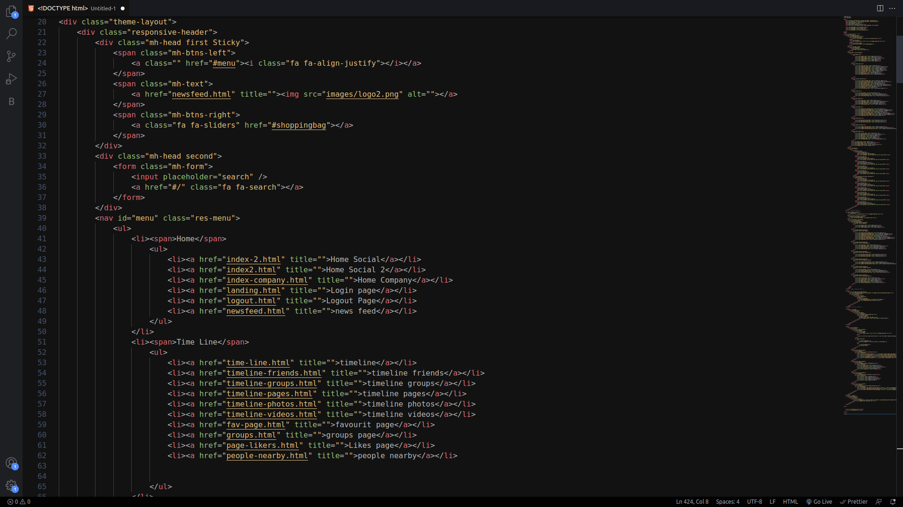

# Tiniri Theme

Tiniri is a visually striking dark theme inspired by the captivating Berber culture of Morocco. Its deep, mysterious color palette and subtle accents create an immersive coding experience that's perfect for nocturnal coding sessions. With its unique blend of darkness and elegance, it brings a touch of cultural richness to your coding environment, setting the stage for inspired coding adventures under the Berber night sky. Let the Tiniri theme envelop you in its enigmatic allure and elevate your coding workflow to new levels of creativity and productivity

## Screenshots



## Installation

```
ext install soufiyane.tiniri
```
